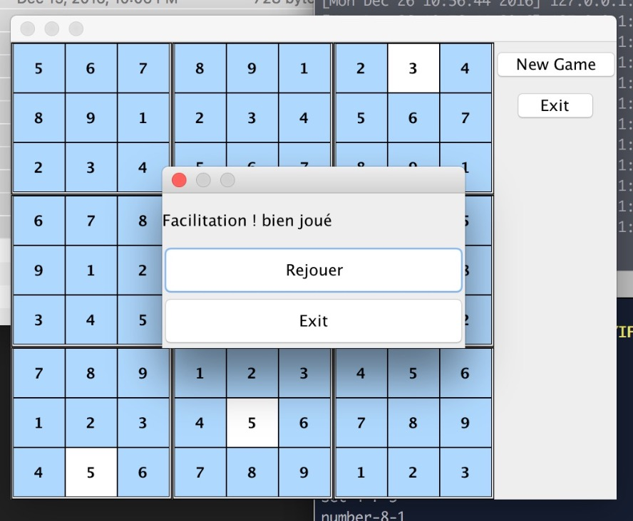

# Sudoku Java RMI clients/server

This is a university project, where we are asked to build sudoku game with client server architecture, using Java RMI for remote calls.




Screenshots under screenshots folder

### Used pattern and API

- Factory
- RMISecurityManager
- RMIClassLoader
- RMIRegistry

### Build

```shell
rm */*.class
cd www
javac *.java
rmic -v1.1 Middle
rmic -v1.1 FabricSudoku
rmic -v1.1 Gui
cp DynamicClient.class ../client
cp DynamicServer.class ../server
```

### Run the server

```shell
cd www
php -S 0.0.0.0:8000 > /dev/null &
cd ../server
cd server
java -Djava.security.policy=server.policy -Djava.rmi.server.codebase=http://localhost:8000/ DynamicServer
```

I user php to run local http server for dynamic loading , you can move the files under Apache/Ngnix server or user node or python to run simple http servers.

### Run the client

```shell
cd client
java -Djava.security.policy=client.policy -Djava.rmi.server.codebase=http://localhost:8000/ DynamicClient
```

### Licence

The MIT License (MIT)

Copyright (c) 2017 Kheder Marwen

Permission is hereby granted, free of charge, to any person obtaining a copy
of this software and associated documentation files (the "Software"), to deal
in the Software without restriction, including without limitation the rights
to use, copy, modify, merge, publish, distribute, sublicense, and/or sell
copies of the Software, and to permit persons to whom the Software is
furnished to do so, subject to the following conditions:

The above copyright notice and this permission notice shall be included in
all copies or substantial portions of the Software.

THE SOFTWARE IS PROVIDED "AS IS", WITHOUT WARRANTY OF ANY KIND, EXPRESS OR
IMPLIED, INCLUDING BUT NOT LIMITED TO THE WARRANTIES OF MERCHANTABILITY,
FITNESS FOR A PARTICULAR PURPOSE AND NONINFRINGEMENT. IN NO EVENT SHALL THE
AUTHORS OR COPYRIGHT HOLDERS BE LIABLE FOR ANY CLAIM, DAMAGES OR OTHER
LIABILITY, WHETHER IN AN ACTION OF CONTRACT, TORT OR OTHERWISE, ARISING FROM,
OUT OF OR IN CONNECTION WITH THE SOFTWARE OR THE USE OR OTHER DEALINGS IN
THE SOFTWARE.